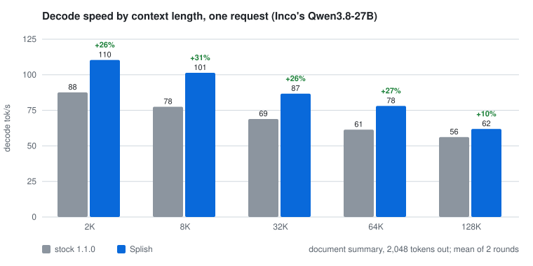
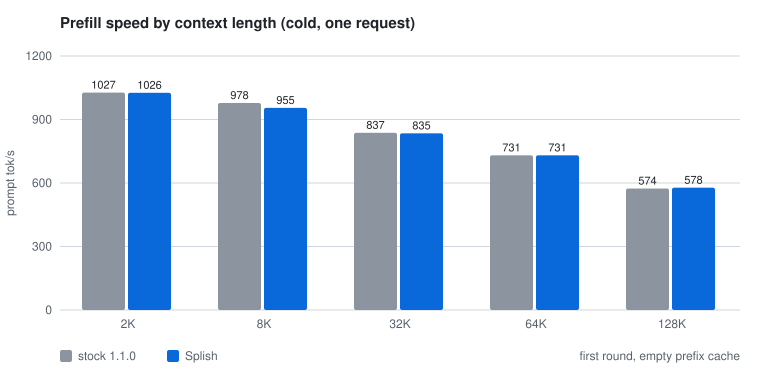

# Splish results by version

All measurements on one 40-core M5 Max (128 GB, macOS 27), against Splash as shipped on the same Mac. Method:
C concurrent requests (1–4), long generations, aggregate decode tok/s counted only while all C decode; each value
the mean of two rounds with stock and Splish alternating; runs vary by up to ~7%, so **differences under about 5%
are ties**. Quality: a 95-task set and a 1,621-item benchmark set, both builds.

## v1.1 (October 2026)

| Change | Measured |
|---|---|
| 27B kernel choices v12 (draft projections at 2–4 requests) | one request +4.1% (+3.1..+5.1) vs v1.0; serving +2.7% / +3.7% / +6.0% at 2 / 3 / 4 requests |
| Qwen3.6-35B-A3B choices v2 | one request +18% steady state, greedy +10.0% (+8.1..+11.9); 2–4 requests +2.6% / +1.8% / 0%; 95/95 |
| GGUF choices v2 (the DFlash draft tuned) | step time Q8_0 −2.8% / −2.8% / −4.9% / −6.6% at 1–4 requests; Q4_K_M −4.5% / −3.9% at 3–4 |
| 20-core M5 Pro table (Michael McCrimmons) | step −6.8% at one request, −6.8 to −8.4% at two, on his M5 Pro |
| Quality | Swift-1.5 on 1,621 items, greedy: stock 82.8%, Splish 82.7% (4 items differ, 1 vs 3; p = 0.63) |
| Fixes | tokenizer (Hindi, Thai, Arabic samples: 14–53% fewer tokens); very thin images padded instead of rejected |

## v1.0 (September 2026)

**Against Splash 1.1.0 as shipped**, on the same Mac with the same models. Each cell is decode
tok/s, stock → Splish (gain); at 2–4 requests it is the total across requests. Models are 4-bit
affine (MLX-style, group 64, the Splash package format) unless marked GGUF, with Splash's default
int8 KV cache and each model's DFlash2 draft. Method below.

| Workload | 1 request | 2 requests | 3 requests | 4 requests |
|---|---:|---:|---:|---:|
| Inco's Qwen3.8-27B, long reasoning | 131 → **178** (+35%) | 223 → **292** (+31%) | 222 → **330** (+48%) | 299 → **392** (+31%) |
| Inco's Qwen3.8-27B, short answers, greedy | 78 → **99** (+26%) | 134 → **164** (+23%) | 138 → **171** (+24%) | 183 → **210** (+15%) |
| Inco's Qwen3.8-27B, short answers, sampled | 74 → **91** (+23%) | 118 → **151** (+28%) | 125 → **171** (+37%) | 163 → **209** (+28%) |
| Inco's Qwen3.8-27B, TensorFold's client: code | 142 → **176** (+24%) | | | |
| Inco's Qwen3.8-27B, TensorFold's client: chat | 75 → **92** (+22%) | | | |
| Inco's Qwen3.8-27B, a 2K–128K-token document ([by context](#by-context-length-v10)) | **+11% to +29%** | 96 → **118** (+24%, 64K) | | |
| Swift-1.5 (a Qwen3.8-27B fine-tune), long reasoning | 141 → **179** (+27%) | 224 → **296** (+32%) | 224 → **342** (+52%) | 288 → **400** (+39%) |
| Qwen3.6-35B-A3B, long reasoning | 331 → **348** (+5%) | 486 → **573** (+18%) | 553 → **672** (+22%) | 642 → **754** (+18%) |

On top of that, the copy rule speeds up whole-file code edits (Swift-1.5, Splish without → with
it): 144 → **180** tok/s (+24%) and 136 → **194** tok/s (+42%).

Quality is unchanged: every model above scores 95/95 on our 95-task set with Splish, as stock did wherever we measured it.

### By context length (v1.0)

One request summarising a document of the given length (a distinct WikiText passage),
2,048 tokens out. Prompts are prefilled into the cache before decode timing starts. Decode
is the mean of 2 rounds (Splish ahead in all 10 rounds); prefill is the cold first round. Inco's Qwen3.8-27B, tok/s, stock →
Splish:

| Context | 2K | 8K | 32K | 64K | 128K |
|---|---:|---:|---:|---:|---:|
| **Decode** | 92 → **109** (+18%) | 74 → **95** (+29%) | 72 → **80** (+11%) | 66 → **77** (+16%) | 54 → **63** (+16%) |
| Prefill | 1,019 → 923 | 829 → 895 | 851 → 864 | 794 → 803 | 701 → 713 |

Decode is faster at every length. Prefill is unchanged: Splish does not touch the prefill
kernels, and these single cold measurements differ by −9% to +8%. Splash's own harness also
finds time to first token even at 2K and 32K.

**Where it is not faster.** Long-context attention itself is unchanged; the lead at 64K
comes from everything around it. Qwen3.6-35B at one request gains only 5%, and GGUF models
about 2%. Energy per token is lower at 3–4 requests, but mixed at 1–2.
[Where stock is ahead or even](#where-stock-is-ahead-or-even) lists every case.

**Method.**
- **Builds.** Stock is vanilla Splash 1.1.0. The fork is this repository with the v8
  choices. Both ran on the same M5 Max with the same packages, side by side on separate
  ports.
- **Serving load.** C concurrent requests (C = 1–4), each generating up to 4,096 tokens
  from a long-reasoning prompt with the recommended sampling (temperature 1.0, top_p 0.95,
  top_k 20).
- **Metric.** Aggregate decode tok/s, counted only while all C requests decode
  (`dev/m5/serve_bench.py`). Package power and GPU temperature come from `macmon` over the
  same window.
- **Repeats.** Each value is the mean of two rounds, with stock and fork alternating. Runs
  vary by up to ~7% (single cells up to 8%), so **differences under about 5% are ties**. On the
  27B packages the fork was ahead in every round (8 of 8 for each).
- **Splash's own harness.** `dev/benchmarks/http_regression.py` (ABBA order, `abba.py`'s
  pass rule) measured decode ms per token and time to first token at 2K and 32K context.
- **Quality.** A 95-task set (maths, code, reasoning, exact-match scoring) on both builds.

**Which build.** The long-reasoning, quality and harness numbers (2026-09-26 overnight) use
the current build, G4a and A4 included. The 512-token rows and Swift's step times predate
G4a and A4. Both changes are bit-identical and affect GGUF models and long context only.

### Where Splish leads (v1.0)

Inco's Qwen3.8-27B package (`incoai/Qwen3.8-27B-Splash`), aggregate tok/s, fork and change
against stock:

| Load | C=1 | C=2 | C=3 | C=4 |
|---|---:|---:|---:|---:|
| Greedy, 512 tokens | 98.8 **+26%** | 163.9 **+23%** | 170.8 **+24%** | 209.7 **+15%** |
| Sampled, 512 tokens | 90.5 **+23%** | 151.3 **+28%** | 171.2 **+37%** | 208.6 **+28%** |
| **64K-token document, summarise, steady state** | 73.4 **+12%** | 118.2 **+24%** | | |
| **Long reasoning, steady state, sampled** | 177.7 **+35%** | 292.0 **+31%** | 329.5 **+48%** | 391.8 **+31%** |
| Energy per token, J (stock → fork) | 0.65 → 0.36 | 0.24 → 0.30 | 0.25 → 0.22 | 0.21 → 0.19 |

Stock for reference: greedy 78.2 / 133.7 / 137.8 / 182.6 tok/s, sampled 73.8 / 118.2 /
124.9 / 163.4, and long reasoning 131.3 / 223.2 / 222.2 / 299.0. Long-reasoning maths drafts
very well (about 6.2 tokens per verify step), which is why its tok/s are higher than the
short answers'.

Swift-1.5 on the same long-reasoning load: 140.5 / 224.2 / 224.1 / 287.7 → **179.0 / 295.8 /
341.5 / 400.2** tok/s (+27% / +32% / +52% / +39%). Energy at 4 requests is 0.32 → 0.18 J per
token.

**TensorFold's client** (`tools/bench_openai.py` from
[ashhart/TensorFold](https://github.com/ashhart/TensorFold), via `dev/m5/tensorfold_bench.py`;
64-token replies, 5 seeds, 2 rounds). Code and chat, sampled and greedy, tok/s:

| | Code, sampled | Chat, sampled | Code, greedy | Chat, greedy |
|---|---:|---:|---:|---:|
| Stock Splash 1.1.0 | 156.6 | 77.8 | 142.1 | 75.1 |
| **Splish** | **202.6** | **88.6** | **176.1** | **91.9** |
| TensorFold 0.3.4, as published for an M5 Max | 168.4 | 69.3 | 154.7 | 73.5 |

The TensorFold row is its own published measurement: a different checkpoint and drafter, a
raw-completion code prompt, and a different session. Treat it as a reference point, not a race.

**Splash's own harness** (`http_regression.py`, ABBA, Inco's pass rule) on Inco's 27B: decode
**5.93 → 4.60 ms per token (−22%), pass**. Time to first token is identical at 32K
(39.5 s vs 39.4 s). At 2K it is +0.7%, but that run's spread was 6.9%, above the rule's 5%
limit, so the rule calls it inconclusive rather than a regression.

Swift-1.5 (a Qwen3.8-27B fine-tune, same shapes), decode step time from Splash's
`decode_profile` with a 2,048-token prompt:

| Requests | Stock 1.0.2 | 1.0.2 + tuned choices | Splish (v8) | Splish (v11) |
|---|---:|---:|---:|---:|
| 1 | 49.0 ms | 41.5 ms | 40.5 ms | **39.4 ms** |
| 2 | 59.1 ms | 59.4 ms | **44.9 ms** | 45.4 ms |
| 3 | 87.2 ms | 88.2 ms | **59.3 ms** | 59.2 ms |
| 4 | 87.0 ms | 85.8 ms | **62.9 ms** | 61.8 ms |

v11 was measured on 2026-09-27 against v8 in the same session (v8: 40.9 / 45.5 / 59.1 / 61.5 ms):
one request −3.7% ±2.3%, two to four unchanged within ±0.5 ms.

At one request the fork adds ~2.5% over tuned choices alone. The gain from the fork's own
kernels is at 2–4 requests (1.3–1.5×).

**Quality.** Swift-1.5 scores 95/95 on both engines, and 380/380 with four copies running
concurrently. On Inco's 27B: stock 95/95, fork 95/95. The fork's greedy text
differs from stock at near-ties because the split-K kernels add in a different order. Both
engines are deterministic run to run.

### Where stock is ahead or even

| Case | Result |
|---|---|
| Speculative acceptance, Inco's 27B | Fork 0.380 vs stock 0.398 (greedy, 16 prompts). Slightly lower; the speed gain covers it. |
| Long-context decode (40K+) | Tie. Attention sets the limit, and the one change kept (A4) is ~3% of attention and not visible per step. |
| GGUF Q8_0 decode, 2 requests | Tie (−0.1%). 1, 3 and 4 requests: ~2% faster. |
| Qwen3.6-35B-A3B (tuning) | Not tuned. The fork's attention change is disabled for its shape, where it was 3% slower. |
| Time to first token, 2K / 32K | Tie (+0.7% / −0.2%). The 2K run was too noisy for Inco's rule to pass it. |
| Qwen3.6-35B-A3B, long reasoning, 1–4 requests | Tie: −2% / −1% / −4% / +2%, inside its 5–7% run spread. |
